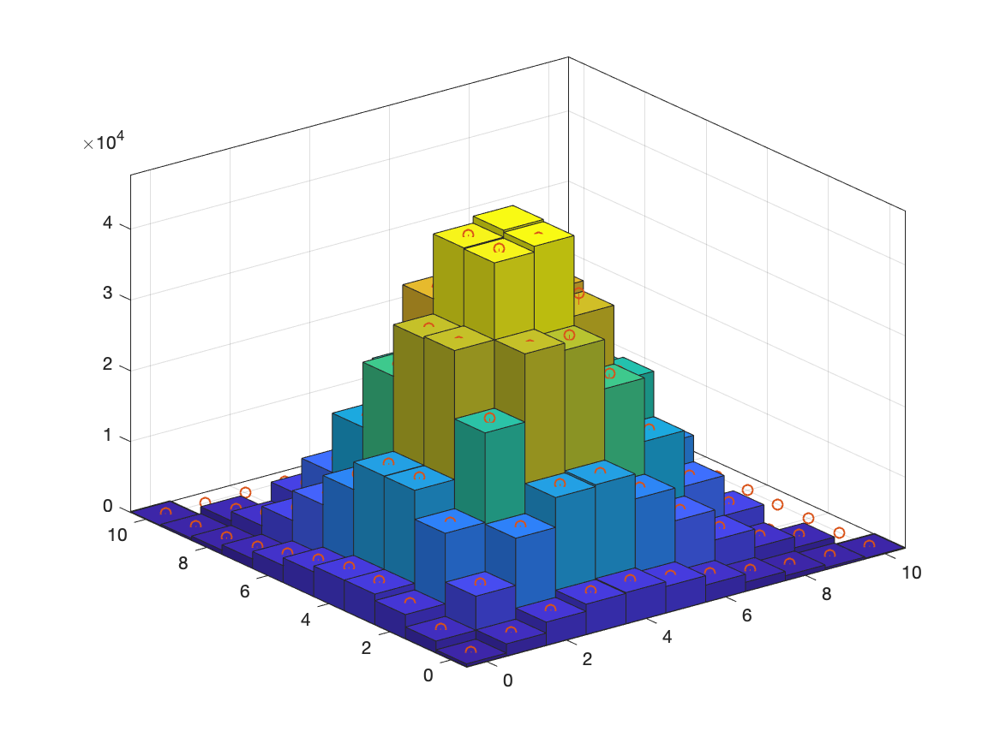
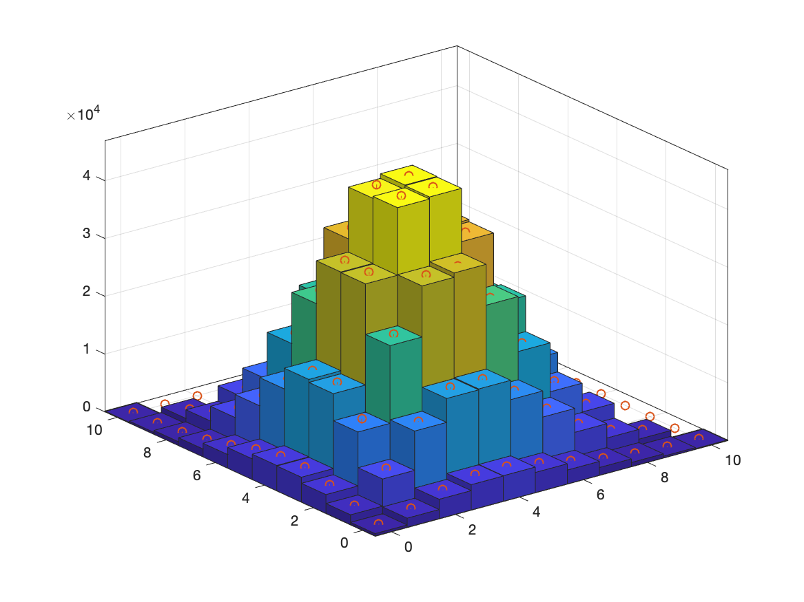

## 1,  Independent Random Walk

There are two kinds of random walk. The one used in RW-MH algorithm is independent of current state, while the other one the random walk always from the current state, which is used in simulated annealing.

---
## 2,  Exercise 6: Random Walk Metropolis-Hastings (RW-MH) Simulation of the Queue Problem

### 2.1,  1-D RW-MH Result


```
Perform Chi-Square Test:
    alpha = 0.05;
    chiSquare = 8.603061 ;
    pValue = 0.570142 ;
    chiQuareCritical = 18.307038 ;
    Accept H0.
```

### 2.2,  Result of Simulation with Two State Variables

The red points shows the theoretical result. It can be seen than the result using ordinary Metropolis-Hastings is not very satisfying, while we can get very good result by using Gibbs Sampler.



```
Perform Chi-Square Test:
    alpha = 0.050000 ;
    chiSquare = 243.148627 ;
    pValue = 0.000000 ;
    chiQuareCritical = 84.820645 ;
    Reject H0.
```



```
Perform Chi-Square Test:
    alpha = 0.050000 ;
    chiSquare = 239.480581 ;
    pValue = 0.000000 ;
    chiQuareCritical = 84.820645 ;
    Reject H0.
```

### 2.3,  Result of Simulation with Two State Variables using Gibbs Sampler


```
Perform Chi-Square Test:
    alpha = 0.05;
    chiSquare = 71.384375 ;
    pValue = 0.274037 ;
    chiQuareCritical = 84.820645 ;
    Accept H0.
```

| ID  | Dim |     Method      | nSample | Chi-Square | Critical Chi-Square | Reject |
|:---:|:---:|:---------------:|:-------:|:----------:|:-------------------:|:------:|
|  1  |  1  |     Direct      | 1000000 |  8.603061  |  18.307038 (0.05)   | false  |
|  2  |  2  |     Direct      | 1000000 | 243.148627 |  84.820645 (0.05)   |  true  |
|  3  |  2  |  Gibbs Sampler  | 1000000 | 71.384375  |  84.820645 (0.05)   | false  |
|  4  |  2  | Coordinate-Wise | 1000000 | 239.480581 |  84.820645 (0.05)   |  true  |

### 2.2,  Array the 2-D Irregular Sample Space for 8-Direction Random Walk

The algorithm and analysis is shared in [edxu96/RandomWalk2dim.m](https://gist.github.com/edxu96/a506b784d1a8864a188a8aa3ce49cc4d).

## 3,  Exercise 7: Parameters and Results in Simulated Annealing

### 3.1,  Annealing Temperature

More control parameters are added in the cooling scheme. `tempMax` is the temperature when `k = 0`, which is also the maximum possible temperature. `coefStretch` and `coefDecay` together control the decaying speed of the temperature, the default values of which are 1 and 0.5.

```matlab
function [temp] = calTemp(k, tempMax, coefDecay, coefStretch)
    temp = tempMax / (1 + coefStretch * k)^coefDecay;
end
```

The differentiation of of `calTemp` is the following equation, which indicates the decaying speed.

```
d calTemp(k) / d k = - coefDecay * tempMax * (1 + coefStretch * k)^(- coefDecay - 1)
```

```
--------------------------------------------------------------------------------
Exercise 7: Simulated Annealing
    Time elapsed = 312.614206 ;
    costResult = 999.000000.
    costSave = 3257.000000.
    ratioAccept = 0.004245.
    node = 1.
    node = 13.
    node = 4.
    node = 3.
    node = 18.
    node = 17.
    node = 11.
    node = 7.
    node = 20.
    node = 9.
    node = 14.
    node = 19.
    node = 5.
    node = 8.
    node = 16.
    node = 10.
    node = 15.
    node = 2.
    node = 12.
    node = 6.
    node = 1.
--------------------------------------------------------------------------------
```

```
[1, 13, 4, 3, 18, 17, 11, 7, 20, 9, 14, 19, 5, 8, 16, 10, 15, 2, 12, 6, 1]
```

### 3.2,  Optimization Result

| series | startPosition | tempMax | nSample | coefDecay | coefStretch | costResult | timeElapse | ratioAccept | fig |
|:------:|:-------------:|:-------:|:-------:|:---------:|:-----------:|:----------:|:----------:|:-----------:|:---:|
|   1    |       1       |    1    | 100000  |    0.5    |      1      |    1585    |   2.6172   |  0.000140   |     |
|   2    |       1       |   100   | 100000  |    0.5    |      1      |    1505    |   2.6622   |  0.005970   |  2  |
|   3    |       1       |   100   | 1000000 |    0.5    |      1      |    1191    |  27.0860   |  0.000571   |  3  |
|   4    |       1       |   100   | 1000000 |    0.4    |      1      |    1022    |  28.1995   |  0.002975   |  4  |
|   5    |       1       |   100   | 1000000 |   0.45    |      1      |    946     |  27.2704   |  0.001052   |  5  |

From the table, we can say that the cooling scheme does affect the result.

The time series of the temperatures and objective values from experiment 6 are plotted in the following graph.


## 4,  Questions

1. when multiple state variables, how to choose the j
2. which random scheme to choose

## 5,  Notes

The number of busy lines in a trunk group (Erlang system) is given by a truncated Poisson distribution

Generate values from this distribution by applying the Metropolis-Hastings algorithm, verify with a chi-square test.
You can use the parameter values from exercise 4.

When do chi-square test, use counts instead of probabilities.

i: can be the number of customer 1
j: can be the number of customer 2
