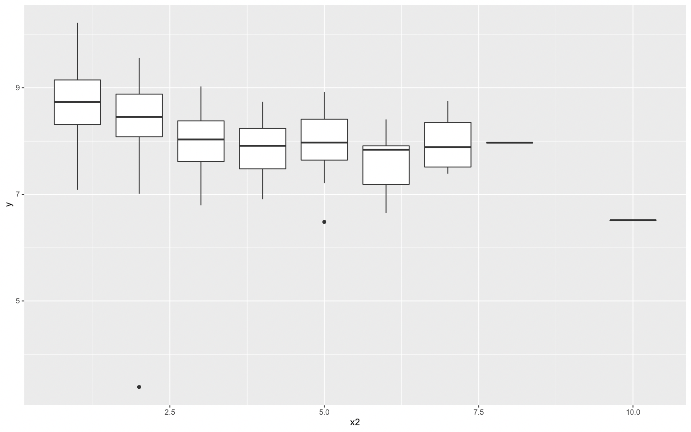
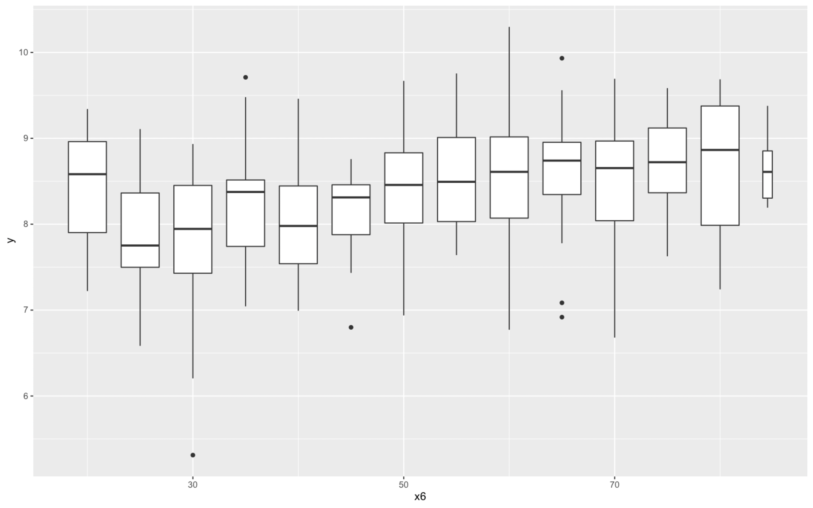

```
glm(formula = know_el ~ age_new, family = "binomial", data = .)

Deviance Residuals:
    Min       1Q   Median       3Q      Max  
-1.9629   0.5611   0.6760   0.8085   1.1221  

Coefficients:
            Estimate Std. Error z value Pr(>|z|)    
(Intercept)  0.13145    0.15045   0.874    0.382    
age_new      0.40943    0.05678   7.210 5.59e-13 ***
---
Signif. codes:  0 ‘***’ 0.001 ‘**’ 0.01 ‘*’ 0.05 ‘.’ 0.1 ‘ ’ 1

(Dispersion parameter for binomial family taken to be 1)

    Null deviance: 1324.9  on 1199  degrees of freedom
Residual deviance: 1271.8  on 1198  degrees of freedom
AIC: 1275.8

Number of Fisher Scoring iterations: 4
```

```
glm(formula = know_el ~ age_new_1 + age_new_2 + age_new_3 + age_new_4,
    family = "binomial", data = .)

Deviance Residuals:
    Min       1Q   Median       3Q      Max  
-1.9364   0.5771   0.7147   0.7175   1.3141  

Coefficients:
            Estimate Std. Error z value Pr(>|z|)    
(Intercept)  -0.3159     0.2223  -1.421 0.155311    
age_new_1     1.0458     0.2940   3.557 0.000375 ***
age_new_2     1.5415     0.2639   5.842 5.15e-09 ***
age_new_3     1.5504     0.2535   6.117 9.55e-10 ***
age_new_4     2.0242     0.2702   7.491 6.86e-14 ***
---
Signif. codes:  0 ‘***’ 0.001 ‘**’ 0.01 ‘*’ 0.05 ‘.’ 0.1 ‘ ’ 1

(Dispersion parameter for binomial family taken to be 1)

    Null deviance: 1324.9  on 1199  degrees of freedom
Residual deviance: 1261.6  on 1195  degrees of freedom
AIC: 1271.6

Number of Fisher Scoring iterations: 4
```

```
Likelihood ratio test

Model 1: know_el ~ age_new
Model 2: know_el ~ age_new_1 + age_new_2 + age_new_3 + age_new_4
  #Df  LogLik Df  Chisq Pr(>Chisq)  
1   2 -635.91                       
2   5 -630.80  3 10.219    0.01679 *
---
Signif. codes:  0 ‘***’ 0.001 ‘**’ 0.01 ‘*’ 0.05 ‘.’ 0.1 ‘ ’ 1
```

General Advice
- Make a list for comments

##

- belonging to a family without children without elders (OCOE)
- belonging to a family with children without elders (WCOE)
- belonging to a family without children with elders (OCWE)
- belonging to a family with children with elders (WCWE)

## Regression Analysis

- Solve the masking problem when many packages are loaded with `conflicted` package. https://www.tidyverse.org/blog/2018/06/conflicted/

### 1. Data Visualization

Briefly describe the variables in Table 1. You can use tabulation, histograms, plots, cross-plots.

```
  x     y           r
  <chr> <chr>   <dbl>
1 x2    y     -0.432
2 x3    y      0.167
3 x4    y      0.0447
4 x5    y      0.150
5 x6    y      0.368
6 x7    y      0.0683
```





### 2. First Regression Model

Estimate a regression model of the log of KWH per person on a constant and numbers of household members.

```
lm(formula = y ~ x2, data = dat)

Residuals:
    Min      1Q  Median      3Q     Max
-5.0238 -0.3795  0.0204  0.4560  1.6022

Coefficients:
            Estimate Std. Error t value Pr(>|t|)    
(Intercept)  8.82671    0.07662 115.200  < 2e-16 ***
x2          -0.20858    0.02523  -8.266 4.62e-15 ***
---
Signif. codes:  0 ‘***’ 0.001 ‘**’ 0.01 ‘*’ 0.05 ‘.’ 0.1 ‘ ’ 1

Residual standard error: 0.6556 on 298 degrees of freedom
Multiple R-squared:  0.1865,	Adjusted R-squared:  0.1838
F-statistic: 68.33 on 1 and 298 DF,  p-value: 4.622e-15
```

```
                 2.5 %     97.5 %
(Intercept)  8.6759255  8.9774969
x2          -0.2582395 -0.1589222
```

Show how you may obtain your slope estimate $\widehat{\beta}_{2}$ in Q2 based on the orthogonal reparameterization.

```
lm(formula = y ~ x1 + x21, data = .)

Residuals:
    Min      1Q  Median      3Q     Max
-5.0238 -0.3795  0.0204  0.4560  1.6022

Coefficients: (1 not defined because of singularities)
            Estimate Std. Error t value Pr(>|t|)    
(Intercept)  8.27606    0.03785 218.632  < 2e-16 ***
x1                NA         NA      NA       NA    
x21         -0.20858    0.02523  -8.266 4.62e-15 ***
---
Signif. codes:  0 ‘***’ 0.001 ‘**’ 0.01 ‘*’ 0.05 ‘.’ 0.1 ‘ ’ 1

Residual standard error: 0.6556 on 298 degrees of freedom
Multiple R-squared:  0.1865,	Adjusted R-squared:  0.1838
F-statistic: 68.33 on 1 and 298 DF,  p-value: 4.622e-15
```

```
                 2.5 %     97.5 %
(Intercept)  8.2015631  8.3505523
x1                  NA         NA
x21         -0.2582395 -0.1589222
```

## 3. Assumption of Normality and Jarque-Bera Test

Suppose (from now on) that the assumption of independence and the assumption of exogeneity of all regressors hold. We can then focus here on testing the assumption of normality and constant error variance.

Plot conditional histograms. How does the sample mean vary with $X$?


Jarque-Bera Test of `mod_1`: `True`


## 4. Assumption of Constant Conditional Variance and White's Test

White's Test of `mod_1`: `FALSE`

## 5.

Check for the presence of any extreme residuals (i.e. outliers), or small groups thereof. If present, try to assess the influence of these outliers on the two mis-specification tests above. Try to identify the outliers and investigate whether they are special/extraordinary with respect to the other variables in Table 1 (or more generally other variables in the dat2). Comment.


After remove data points 241, 163 and 36, `mod_4`:

```
lm(formula = y ~ x2, data = .)

Residuals:
     Min       1Q   Median       3Q      Max
-1.45726 -0.41179  0.00286  0.43826  1.52842

Coefficients:
            Estimate Std. Error t value Pr(>|t|)    
(Intercept)  9.02886    0.07304  123.61   <2e-16 ***
x2          -0.25999    0.02565  -10.14   <2e-16 ***
---
Signif. codes:  0 ‘***’ 0.001 ‘**’ 0.01 ‘*’ 0.05 ‘.’ 0.1 ‘ ’ 1

Residual standard error: 0.607 on 295 degrees of freedom
Multiple R-squared:  0.2584,	Adjusted R-squared:  0.2558
F-statistic: 102.8 on 1 and 295 DF,  p-value: < 2.2e-16
```

## 6.

Augment the model with the remaining variables in table 1. Call the augmented model. Perform the JB and White's test again. What are your conclusions now?


If your model is still mis-specified, you may consider adding other variables, and/or adding transformations of some of the variables in table 1 e.g. polynomial (say, squares and/or cubic) terms.

## RESET Test

Assumption of Functional Form and RESET Test

RESET Test of `mods[[1]]`: `FALSE`
